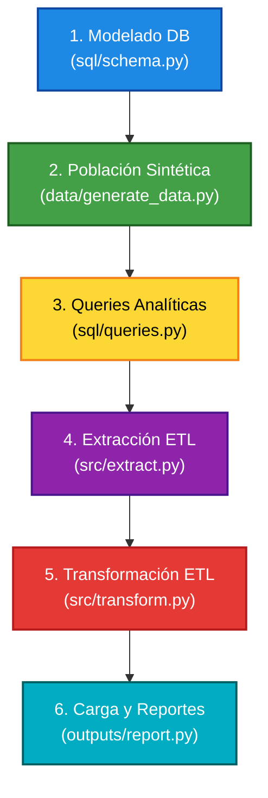
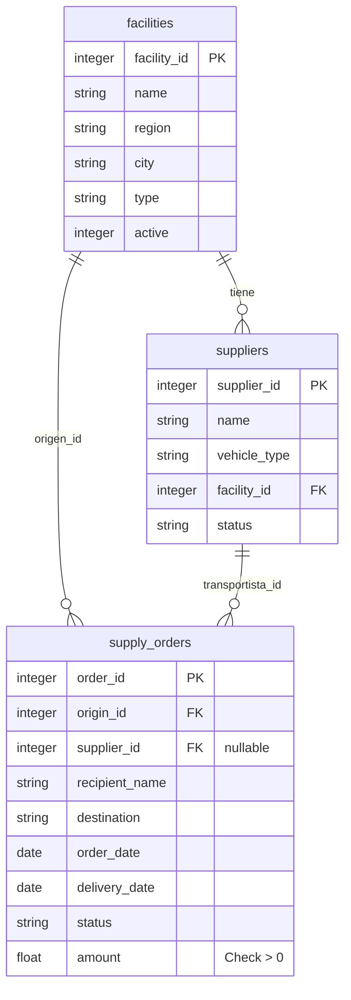

# 🌐 NERV-Chile: Sistema de Operaciones y Pipeline ETL

Bienvenido a la División de Operaciones de NERV. Tras la expansión de las instalaciones al cono sur, la base de operaciones en Chile requiere un sistema de datos robusto que soporte la logística interna. 

Este repositorio contiene la solución completa para la **gestión de suministros críticos**, **seguimiento de despachos** y **monitoreo de indicadores operacionales** para el equipo de comando, desarrollado íntegramente en Python utilizando tecnologías modernas de Data Engineering por José Francisco Soza Concha

---


## 🚀 Contexto de la Misión

Nuestra misión fue construir una base de datos relacional para registrar los pedidos de suministros entre las distintas instalaciones de NERV-Chile, implementar consultas analíticas vitales para los reportes diarios y desarrollar un **pipeline ETL (Extract, Transform, Load)** automatizado que asegure la calidad de los datos para la toma de decisiones. Las decisiones operacionales de la base dependen de la calidad y disponibilidad de estos datos, por lo que la rigurosidad en el modelado y la claridad del código fueron de máxima prioridad.

> 💡 **Nota Importante:** Este proyecto fue realizado en su totalidad en el IDE **Antigravity**. Se optó por **SQLite** para la generación y manipulación de bases de datos dada su naturaleza local y ligera. Por esta razón, **no existen archivos `.sql` puros**, ya que el **ORM SQLAlchemy** se utilizó para realizar toda la definición de esquemas, consultas y manipulación estructurada directamente y 100% en Python.

---

## 🛠️ Arquitectura y Flujo de Trabajo (Flujo Visual)

El proyecto se divide secuencialmente en las siguientes etapas. Puedes seguir el flujo ejecutando los scripts en el siguiente orden:



---

## 📂 Descripción Detallada por Componente

### 1. Modelado de Base de Datos (`sql/schema.py`)
Archivo encargado de definir la estructura relacional de cero utilizando SQLAlchemy.
- ⚙️ **Conexión:** Configura el engine apuntando a la base de datos `data/NERV.db`.
- 🏗️ **Esquema:** Declara los modelos ORM estrictos: `Facility`, `Supplier` y `SupplyOrders`.
- 🔐 **Reglas de Negocio:** Implementa restricciones de integridad como Foreign Keys, variables opcionales (Nullables) y CheckConstraints (asegurando que los montos financieros sean siempre > 0).

**Esquema de la Base de Datos:**


### 2. Generación de Datos (`data/generate_data.py`)
Puebla la base de datos desde cero con datos hiper-realistas mediante la librería `Faker` y lógica condicional algorítmica.
- **Distribución:** Crea sucursales dinámicas con al menos 1 fuera de servicio, y transportistas con distintas disponibilidades. Genera 300 pedidos a lo largo de los últimos 90 días, con una distribución de estados realista (75% entregados, etc).
- **Manejo de Nulos (NULL):** Aplica lógica estricta para que ciertos pedidos `pending` queden huérfanos sin transportista asignado, desafiando a las queries futuras.
- **Inyección de Inconsistencias:** Almacena registros erróneos diseñados intencionalmente (ej. entregas sin fecha, fechas en el pasado, o en tránsito con fecha completada) para poner a prueba el motor de transformación del pipeline ETL.

### 3. Consultas Analíticas (`sql/queries.py`)
Explota la base de datos usando Raw SQL encapsulado en Python, respondiendo directamente a operaciones complejas de gestión:
- 📊 Resumen operativo por instalación.
- 🏆 Top de transportistas más eficientes (Últimos 30 días usando Date Math).
- 📉 Tasa porcentual de fallos por región de destino (calculada con GROUP BY y HAVING).
- 🔍 Listado de pedidos sin transportistas usando cláusulas `IS NULL`.

### 4. Extracción ETL (`src/extract.py`)
El motor de extracción de datos masivos.
- **Configurable:** Se conecta de manera dinámica usando la librería `argparse` para inyectar URLs por consola.
- **Filtro Nativo:** Trae eficientemente solo los registros de los últimos 60 días directamente desde el motor SQLite.
- **Raw Export:** Genera el log de métricas y guarda el archivo en formato `.csv` en `outputs/orders_raw.csv`.

### 5. Transformación ETL (`src/transform.py`)
Fase de limpieza, enriquecimiento y Data Quality (DQ).
- **Métricas:** Calcula iterativamente variables clave usando Numpy y Pandas: Días totales de entrega (`delivery_days`), banderas booleanas de atraso logístico (`is_late`) y un categorizador de volumen de compra (`amount_range`).
- **Data Quality Alerts:** Realiza un escaneo de cruces semánticos, enviando alertas de consola al detectar los registros inconsistentes inyectados en la fase 2.
- **Curated Export:** Genera el dataset limpio final en `outputs/orders_transformed.csv`.

### 6. Reportes y Visualización (`outputs/report.py`)
Genera la inteligencia de negocio final requerida por el mando general.
- Imprime un sofisticado panel de KPIs interactivo de las métricas vitales (Tasas de éxito/fallo y Tiempos promedio).
- **Tablas:** Agrupación y pivote de rendimiento segregado por la región geográfica de destino.
- **Visualización:** Emplea `Matplotlib` para generar dos gráficos exportables listos para presentaciones directas:
  - 📊 `pedidos_por_status.png` (Barras).
  - 📈 `evolucion_semanal.png` (Líneas de tendencia temporal).

---

## ⚙️ Requisitos e Instalación

Para ejecutar y validar este proyecto desde cualquier lugar, se requiere el archivo `requirements.txt` adjunto en este repositorio.

1. Clona el repositorio e ingresa al directorio raíz.
2. Genera y activa un entorno virtual de Python:
   ```bash
   python -m venv venv
   # En Linux/Mac:
   source venv/bin/activate
   # En Windows:
   venv\Scripts\activate
   ```
3. Instala todas las dependencias requeridas:
   ```bash
   pip install -r requirements.txt
   ```
4. Ejecuta el pipeline en orden consecutivo para disfrutar la magia de los datos:
   ```bash
   python sql/schema.py
   python data/generate_data.py
   python sql/queries.py
   python src/extract.py
   python src/transform.py
   python outputs/report.py
   ```

---


*Felicidades Shinji*

